# Fun With Unity

## Table of contents
1. [Goal](#Goal)
2. [Preview](#Preview)
3. [Instructions](#Instructions)
4. [Conclusion](#Conclusion)
5. [Submitting](#Submitting)
6. [Bonus Levels: Where can we go from here?](#bonus-levels-where-can-we-go-from-here)

## Goal

Get some hands-on experience with connecting our Arduino to Unity. We will send data to Unity from the Arduino and vice versa. The demos here are simple, but they are great starting points and proof of functionality.

## Preview

This is a preview of what we will have by the end of the exercise.

[](https://youtu.be/i41ObD9AJeo?list=PLUzUMAB7oUTeWzJGtpiETo4tBbwV8X-_L)

[YouTube Video: Arduino Unity Serial Demo](https://youtu.be/i41ObD9AJeo?list=PLUzUMAB7oUTeWzJGtpiETo4tBbwV8X-_L)

## Instructions

The first thing we need to do is to basically re-create the circuit from HW: 14 - Tweak the Logo.  

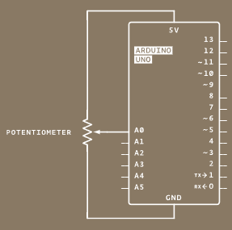

The only major change that we will add to this is also placing an LED onto the board. You can see my updated circuit below.

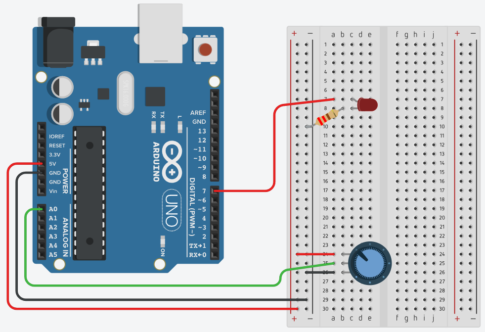

Next, we need to open up the Arduino IDE and code up the Arduino side of things. Again, this should remind you of HW 14.

Way at the top of our program, we should add in some variables that we will use later. Let's make an `int` called "readData" and a `long` called "mappedData".

You can see my code below:

```
int readData = -1;
long mappedData = 0;
```

After that, we need to put a few lines of code in our `setup()` method. Because we are working with serial connections, we need to start up our serial stuff. Do you remember how to do that? We call `Serial.begin()`. Don't forget to put in the appropriate baud rate. 

We won't need this until the second half when we receive data back from Unity, but I'll also set up my LED now. I plugged mine into digital pin 7. So I set that as an output. Then, I'll start it in the "on" position.

You can see my code below:

```
  // initialize serial communication
  Serial.begin(9600);

  pinMode(7, OUTPUT);

  digitalWrite(7, HIGH);
```

That is all we will need for `setup()`. Now to move on to `loop()`.

Before we send any data over the serial connection, we need to have some data to send! We will be using the potentiometer we connected to pin A0 to control and move a cube in our Unity scene. So let's grab the rawData from the potentiometer.

```
readData = analogRead(A0);
```

Next, for ease of use, I think we should map that data. I'll map it from -100 to 100. I picked these numbers because I think they will help for what I'm doing. 

Some things that went into my thought process were:
- 0 to 1 seems like a good "range" for analog. that is usually my default. but here I want to move a cube left and right. knowing what I'm doing later, I think I'll use this as a modifier of some sort to position, so having it be -1 to 1 might be easier for me for later.
- then I also multiplied it by 100. I wanted that decimal precision later on, and the map function doesn't play nice with floats because of its integer math. so, if I multiply it by 100 now. I can always divide it by 100 later to get that precision on my 0-1 esq scale. 
- again, I have the luxury of writing both ends of the code here, so I can kinda do what I want. But if you were a tools programmer, you might want to make this a little more standardized. 

I store that new mapped data in our variable from earlier.

```
mappedData = map(readData, 0, 1023, -100, 100);
```

Now, you definitely should check out the [Arduino reference for serial communication](https://www.arduino.cc/reference/en/language/functions/communication/serial/). But I kinda know I'll be taking advantage of Unity serial stream and read it in as a string. So I've decided to go with the `print` and `println` functions in the next part. You should also be asking yourself, "How should we structure our data?" Again, I'm taking advantage of knowing how I'll interpret the data on the other end, so I kinda made my own "data buffer" with my own "struct". I make a "CSV" on a single line. 

You can see my code below:

```
  Serial.print("Hi");
  Serial.print(",");
  Serial.print(readData);
  Serial.print(",");
  Serial.print(mappedData);
  Serial.println();
```

I have the first value there as a test. "Hi" won't really help us do anything today. Honestly, the only value we really care about will be `mappedData` but I wanted to showcase sending multiple pieces of data over to Unity. I end my "struct" with a blank `Serial.println()` to append that new line character to make it easier when we interpret the string on the Unity side of things. 

At this point in time, this is what my Arduino code looks like: 

```
int readData = -1;
long mappedData = 0;

void setup() {
  // initialize serial communication
  Serial.begin(9600);

  pinMode(7, OUTPUT);

  digitalWrite(7, HIGH);
}

void loop() {
  // read the value of A0 (the twisty knob)
  readData = analogRead(A0);
  
  //map it
  mappedData = map(readData, 0, 1023, -100, 100);

  //Unity Read as a string?
  //String for Unity

  Serial.print("Hi");
  Serial.print(",");
  Serial.print(readData);
  Serial.print(",");
  Serial.print(mappedData);
  Serial.println();
}
```

Ok. We are good on the Arduino side for now. We will come back to it later, but let's jump into Unity for now.

Go ahead and open up a new Unity project. For this demo, I just used the default 3D core, as I'll just be moving a cube left and right, nothing too fancy. 

Before we start any coding, we need to set up Unity for serial communication. Later on, we will use `System.IO.Ports`. We won't find this with the default Unity settings. If we try to code this without setting Unity up, then we are going to have a bad time.

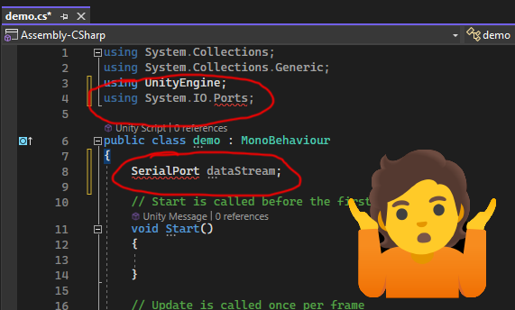

We want our code to play nice! 

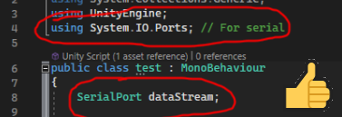

So how do we do that? 

It's not too bad. We just need to change the Api Compatability Level from `.NET Standard 2.1` to `.NET Framework`.

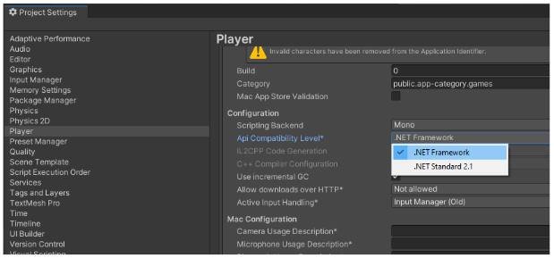

I find the setting here:

Edit → Project Settings → Player → (drop down) Other Settings → (scroll down) Configuration → Api Compatibility Level

But it may be different on your version of Unity or if they update it again in the future. You can read up more on this topic on the Unity docs if needed.

Unity should auto-save and auto-update that change, so feel free to close the Project Settings window. 

Awesome, now we should have access to the proper libraries.

Let's go back to our Unity scene. 

I personally like to keep things clean and organized. So I'll make a new scene and place it in my scenes folder. I'll also make a scripts folder. I'll make a new cube and place it in my new scene. I'll also make a new script called `demo` and place that in my scripts folder.

My scene looks something like this now:

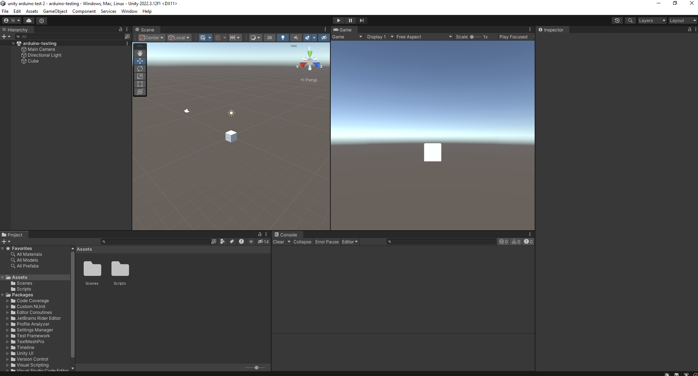

Alright, let's go ahead and open up that script in your editor of choice. I'll use Visual Studio.

The first thing we need to do in here is include the `using System.IO.Ports` at the top of our file. We will need this library for serial communication.

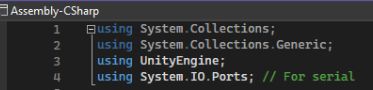

The next thing we need to do is prepare our data stream.

I'll set up some variables. I'll make a variable called `dataStream` which is a `SerialPort`, but you can name it whatever you want.

I'll then make 2 helper variables, a `string` called "serialPort" and an `int` called "baud". I'll make them both public, this way I can easily access them from the Unity editor if I need to later. I'll also set them to "COM1" and "9600" respectively.

I'll also make 2 more variables.

One will be a private string called "receivedString", I'll be using this to grab the data we receive from the Arduino.

One will be a public Transform called "moveableCube". I will use this later to move the cube in our scene.

As of right now, my code looks like this:

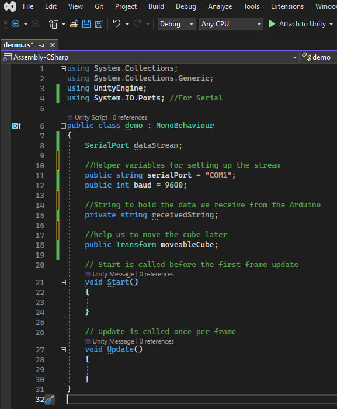

The next thing we need to do is set up and start the stream.

Let's jump into the `Start` method and add 2 more lines of code.

The first line will be to set up the serial connection with our proper port and baud. The second will actually open the stream.

```
dataStream = new SerialPort(serialPort, baud);
dataStream.Open(); //Open the stream
```

Awesome. Now we are set to go. Almost to the cool stuff! Let's jump into our `Update()` method now.

This is the part I usually get the most excited for. The very first "hello world" part of the code. The first visual result of all the prep work. 

Let's add in 2 more lines to start this part off. First, let's read from the data stream by calling `.ReadLine()` and store the result in our `receivedString` variable from earlier. Then, so we can see the cool data, let's print `receivedString` to the console.

```
    void Update()
    {
        receivedString = dataStream.ReadLine();
        Debug.Log(receivedString);
    }
```

If you haven't already, make sure your Arduino code has been uploaded to your board. Also, check what COM port your board is attached to. Mine happens to be `COM4`. I'll need that info in a bit. 

With the code uploaded and the board turned on it should look like this:

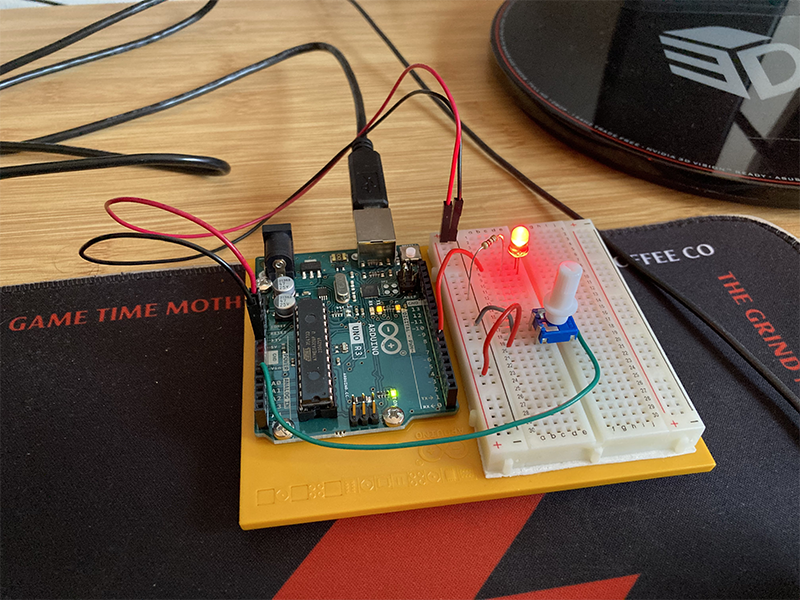

If you recall, we originally set the LED to "on", so, I am happy to see it nice and bright.

Let's go back to the Unity editor for a minute. Let's make sure our script is attached to our cube and that all the data is looking correct.

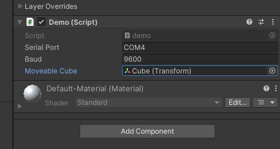

I changed my serial port to COM4 because that is where my board was connecting to. Also, make sure your baud rate matches. We don't need this right now, but we might as well set the `moveableCube` variable to our cube's transform.

Ooh boy! Now the exciting part. Let's hit play and check out that console.

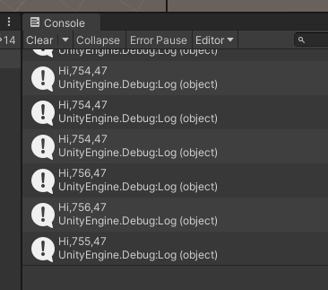

Oh yay. Sweet sweet prints. Go ahead, turn the knob. Do you see the values update? 

Ok, now that we have our first meaningful interaction with the console, let's go back and finish up our work in `Update()` to make our cube move. Again, I haven't used Unity in a while, so maybe the way I did this isn't perfect, but it gets the job done. Again, my focus here is to have proof of concept of using an alternative interface to change the state of my game world, not necessarily have perfect Unity code. So if you think you have a cleaner way, then by all means feel free to do your own thing here.

Ok, back in `Update()` let's do some work on that `receivedString`. 

I'm going to take advantage of how I set up my stream here. I know I've said that a few times now, but it kinda is important. How you structure your buffers and take advantage of being able to write both ends of the code is important. You'll probably be asking yourself similar creative questions when you work on your projects.

I'll take my string and split it up on `,` because I know its a CSV. I'll also print out to the console the length of my substrings. I like doing this as a sanity check to see what the computer is reporting, but we can also use length later on to make sure we don't try to read from a data element that doesn't exist.

```
string[] substrings = receivedString.Split(',');
Debug.Log("substring length: " + substrings.Length);
```

Next, I'll add in an if statement. Just to check that "something" exists before I begin to grab data. You can probably come up with a better check yourself.

Inside this if statement, I'll also print out my first value, which I expect to be my "hi" from earlier. I'll also grab element 2, which I know to be my mapped data, parse it into a float, save it, scale it, and then use that to move my cube. 

```
        //check to see if there is more than one element
        if(substrings.Length > 1)
        {
            //Should print the "hi" in the console
            Debug.Log(substrings[0]);

            //grab my mapped pos data
            float newX = float.Parse(substrings[2]);
            newX = newX / 100.0f; //scale to get that decimal precision

            //move the cube
            moveableCube.Translate(newX * Time.deltaTime, 0, 0);
        }
```

After the if statement, I'll also add in `dataStream.ReadExisting();`. If I understand the documentation correctly, then it should help with Serial Flow Control issues like we talked about in class and is explained here but with p5js. [NYU p5js serial flow control](https://itp.nyu.edu/physcomp/labs/labs-serial-communication/two-way-duplex-serial-communication-using-p5js/)

The current state of my `Update()` looks like this:

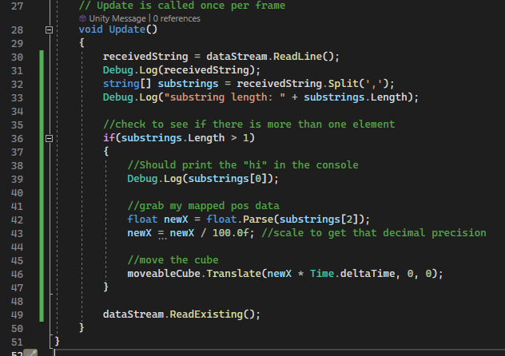

Now we should be able to save, re-run our scene and see the cube being manipulated by twisting the knob. We should also be able to see our new additions to the console print log.

Awesome work so far! Great job!

Now, let's send some data back from Unity to our Arduino. When the cube is on the left side of the screen, let's turn our light on. When the cube is on the right side of the screen, let's turn our light off. 

We will need to write some code in both Unity and back in Arduino land to make this happen. Let's do the Unity side first. 

So, still in `Update()`, but after the `dataStream.ReadExisting()`; Let's add in an `if, else` statement that checks on the position of our cube. I'll also add in some logical prints so we can keep track in the console.

This time I won't get fancy with my "struct". I'm just going to write a '1' or a '0' to the stream and call it a day.

```
if (moveableCube.localPosition.x < 0)
{
    Debug.Log("turn light on");
    dataStream.Write("1");
}
else
{
    Debug.Log("turn light off");
    dataStream.Write("0");
}
```

This is the final state of our `Update()` method.

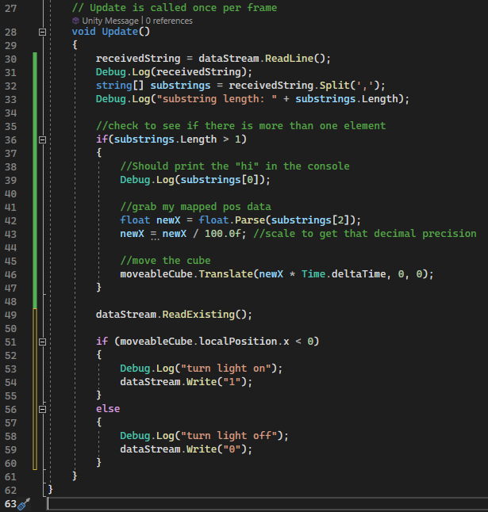

Now, we should also probably close our stream somewhere as part of the cleanup. I'm not worried about that right now because our demo is super short. But in a larger project or game, you should be aware of your project state.

Ok, let's jump back to Arduino land.

Let's pick up where we left off and add some code right underneath that last `Serial.println();`.

I'm going to check if there is info to be read on the serial port, then read that data in, and either turn on or off my light. 

You can see the code here:

```
  if(Serial.available())
  {
    int data = Serial.read();

    if(data == '1')
    {
      digitalWrite(7, HIGH);
    }
    else{
      digitalWrite(7, LOW);
    }
  }
```

Now, I'm just dealing with the data here raw. I'm collecting it as byte data, only looking at the first byte, then doing something with that data.

You should get familiar with the [Arduino reference for serial communication](https://www.arduino.cc/reference/en/language/functions/communication/serial/) because you might need to build your structs and read your data in a different way for your project.

At this point, if you save and re-upload your code to the Arduino, then when you re-run the Unity scene, you should see the light turn on and off based on the cube's position.

Which again can be seen here: [YouTube Video: Arduino Unity Serial Demo](https://youtu.be/i41ObD9AJeo?list=PLUzUMAB7oUTeWzJGtpiETo4tBbwV8X-_L) 

Now I noticed a slight lag, so I added in a small delay at the end of my Arduino program's loop. This may or may not be needed on your machine. 

## Conclusion

At this point, you have successfully connected your Arduino and Unity. You have used an alternative controller to change the state of the game world by moving a cube with a potentiometer. You have also used the state of the game world to affect the physical world by turning on and off an LED based off a cube's position.

I'm sure you can now use your imagination to take this simple demo to the next step! What else can you do or manipulate? Maybe instead of turning on an LED we turn on a motor and use that to move a real-life race car when a user presses the "go button" in the game like in Mario Kart Live Circuit. Maybe we build a really cool racing wheel and use that to control our race car in game. There are a lot of possibilities here!

If you want my full code reference for Arduino and Unity, you can find them in the resources section. You can use it as a reference to double-check your work. 

## Submitting

Please don't forget to submit to the mycourses dropbox. You can find details there.

## Bonus Levels: Where can we go from here?

If you add on to this, then make a blog post about it! Tell us all the cool things you did!