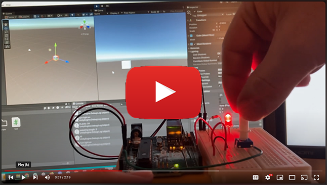

# Fun With Unity

## Table of contents
1. [Goal](#Goal)
2. [Preview](#Preview)
3. [Instructions](#Instructions)
4. [Conclusion](#Conclusion)
5. [Submitting](#Submitting)
6. [Bonus Levels: Where can we go from here?](#bonus-levels-where-can-we-go-from-here)

## Goal

Get some hands on experience with connecting our Arduino to Unity. We will send data to Unity from the Arduino and vice versa. The demos here are simple, but they are great starting points and proof of functionality.

## Preview

This is a preview of what we will have by the end of the exercise.

[Youtube Video: Arduino Unity Serial Demo](https://youtu.be/i41ObD9AJeo?list=PLUzUMAB7oUTeWzJGtpiETo4tBbwV8X-_L)

## Instructions

## Conclusion

## Submitting

## Bonus Levels: Where can we go from here?